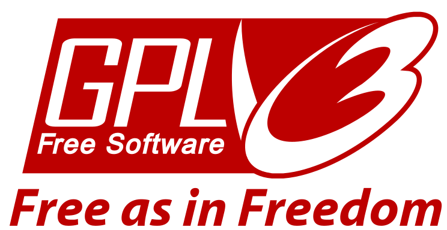

= Mycelium Entropy +++ +++User Manual =
:icons: font
:stylesdir:
:scriptsdir:
:hide-uri-scheme:
:prewrap:
:docinfo1:
:led: pass:[<object data="me.svg" type="image/svg+xml" style="width: 6em; height: 5em"></object>]

== Getting Started ==

++++

<object data="me-full.svg" type="image/svg+xml" style="width: 100%; height: 20em"></object>

++++

Your cute little new device provides a very secure way to print paper wallets.
However, the security of a system is--at best--only as good as its weakest link.
So please observe the following words of caution before you begin:
[WARNING]
====
* Do not use on printers that contain hard drives, or that store an
archived copy of printed documents.
These are mainly large office copy and print stations, but may include home
printers in the future.
* It is recommended to disconnect your printer from your computer and network
before use.
====

.Printing a Bitcoin wallet:
. Insert Mycelium Entropy into your printer's front USB port, the one typically
used to print photos from thumb drives and USB cameras.
. When the paper wallet image is detected, select the image and hit _print_.

IMPORTANT: After printing is complete, it is recommended to cycle your printer's
power before reconnecting it to clear any image cache that may be left in the
printer's memory.

If you wish to create a new paper wallet, push the button on your
Entropy device, and wait a few seconds for your printer to detect a new image.

NOTE: If the device is unplugged and then plugged in again too soon, it will
not be able to collect enough high quality entropy.  In this case it will
refuse to generate a wallet and indicate this by flashing a series of three
blinks.  Please wait a few seconds between removing and re-inserting your
device.

To create a 2-of-3 split key wallet, briefly press the button right after
inserting the device into your printer. This will create a Bitcoin address with
a private key that is split into 3 parts, requiring a combination of any 2 of
them to be able to spend from it.  To make another one, double-click the button.
You can use Mycelium Wallet's _Cold Storage_ function to spend from these
wallets.

A number of printers have been tested for compatibility.  They are listed in
<<Appendix A: Printers>>.

For technical information about Mycelium Entropy and why it is secure, please
see <<Appendix B: How It Works>> and the
link:https://github.com/mycelium-com/entropy[source code].

=== Indications ===

Mycelium Entropy uses its LED to tell you its status.  Move your mouse
over, or touch the table below to see these notifications in action.

[role=ui_leds, cols="^.^2,^.^1,5"]
|===
|fast blinking|[ui_busy]#{led}#
|Device is busy. +
It takes about 5 seconds to generate a normal wallet, or 10 to make an HD
wallet or to upgrade the firmware.  The device will blink rapidly if any of
these actions are in progress.

|slow blinking|[ui_normal]#{led}#
|Normal operation. +
Your wallet is ready.  You can request another one by briefly pressing the
device's button.

|series of blinks (repeating)|{led}
|Warning or error. +
The number of blinks is the message code.  See <<Blink Codes>> below.

|steady light|[ui_on]#{led}#
|USB communication problem. +
You can see this if you plug your device into a USB charger instead of a proper
host.

|slowly pulsating|[ui_pulsating]#{led}#
|Configuration and update mode.

|switched off|[ui_off]#{led}#
|End of firmware update or configuration check. +
It is now safe to unplug the device.
|===

== Secret Sharing ==

Mycelium Entropy can split a generated private key into three parts in such a
way that:

* any two can be combined to recover the key; and
* no single part reveals any information about the private key that can assist
an attacker.

This method is commonly known as _Shamir's 2-of-3 Secret Sharing Scheme_.
It is implemented according to the specification at
https://github.com/cetuscetus/btctool/blob/bip/bip-xxxx.mediawiki.
Funds from a split wallet can be spent with Mycelium Bitcoin Wallet.

Mycelium Entropy does not currently support this scheme with Hierarchical
Deterministic wallets.

=== Motivation ===

Secure long-term backup and storage of secrets is of particular importance to
Bitcoin users. So far various techniques have been used including storing plain
text private keys and password encrypted private keys on paper.

Storing plaintext private keys has the obvious drawback that anyone who sees it
can steal your funds.

Storing password encrypted private keys has another drawback. You turn your
private key into two components, where both are needed to reveal the private
key. While you prevent someone getting one component from revealing the private
key, you make it more likely that you lose control over your private key
yourself. If you lose one component due to flood, theft, or fire, you will have
lost control over your private key.

With this secret sharing scheme, if you discard one of the shares right away
(making it a 2-of-2), you have a setting comparable with classic password
encrypted private keys, with the added benefit that both components are equally
strong.  The availability of the third share simply provides additional
flexibility.

=== This is not Multi-Sig ===

Bitcoin supports two multi-signature schemes
(link:https://github.com/bitcoin/bips/blob/master/bip-0011.mediawiki[BIP-11],
link:https://github.com/bitcoin/bips/blob/master/bip-0016.mediawiki[BIP-16]), in
which redeeming a transaction requires signatures by multiple private keys.

Secret sharing is not a replacement for multi-sig transactions.  Rather, it
provides a secure mechanism for storing and protecting private keys, which in
turn can be used for multi-signature or classic transactions.

== Security ==

An ordinary application running on a regular computer can read files from a USB
drive and transmit them over the Internet.  Such an application need not look
like a “virus”, and the computer need not be “infected” for that to happen.
That's why it is highly inadvisable to print Mycelium Entropy wallets intended
for any serious amounts through a computer--unless that computer will _never_ be
connected to the Internet, will _always_ be physically secure, and you know
what you are doing.

Please print your wallets directly on a printer from your Entropy.

It is, of course, perfectly safe to plug Mycelium Entropy into a computer.
While the wallets generated this way should be considered compromised and should
only be used for experiments, the device itself is not under any threat.  Even
a computer full of malware cannot compromise any previous or future
wallets from this device.
_There are certain simple precautions that must be followed in the
Configuration and Firmware Update mode;_ they are described in the corresponding
section of this manual.

However, please keep in mind that some printers are more secure than others.
The following advice is taken from a
link:http://www.reddit.com/r/Bitcoin/comments/2aodta/on_printer_memory_for_the_security_of_printed/[report by luckdragon69].

.Printers without a hard drive:
Pretty much any home/personal printer will not have a hard drive, but most will
have some kind of memory installed. The type of printer, as well as the model,
will determine how much, if any, memory is installed.

NOTE: Even old printers (laser, dot matrix, inkjet, etc.) had some kind of
memory that they used for storing data while printing.

Most memory that is in home/personal printers only hold the data for the current
print job from anywhere from a few lines to a few pages, as the job is being
printed. Once the job is complete or the printer is turned off, any data that
was in memory is erased and unrecoverable. Printers commonly use basic RAM memory,
which is commonly referred to as volatile memory since it cannot store data once
power is removed.

NOTE: In some cases the printer may be using volatile memory with a battery
backup.  If it is, this should be mentioned in the user guide. In that case,
leave it unplugged for however long the user guide says is too long.

.Printers with a hard drive:
Large office printers usually have a hard disk that may keep either a full copy
of everything they print, or metadata, containing the filename and the user who
created the print job.

* If the printer allows you to bypass its internal hard drive and print directly
from RAM, select this setting for better security to ensure that print jobs
are not stored on the printer hard drive.
* If the printer allows you to overwrite the data immediately after printing (or
scanning or faxing, if it’s an all-in-one device), select that option.
* Almost all new models include a wipe disk function for decommissioning the
printer, and most include disk encryption, so if one takes the disk out of the
printer they won't be able to read the information stored on it.
* If you do choose to store print jobs on the drive, ensure that it is encrypted
with a strong encryption method, such as AES.

== Configuration ==

Certain features, such as other coin types or Hierarchical Deterministic
wallets, can be enabled and configured by placing Mycelium Entropy into
_Configuration mode:_

[[conf_mode_led]]
. pass:attributes[{led}]
Hold the button down while inserting the device into your computer.
. The device's LED will pulsate slowly.
(Hover or touch here to see it).
. Your computer should detect a USB disk labelled `ME-CONFIG`.
** In case of a problem, see ‘link:#disk_broken[If a problem with the disk is
reported]’ below.
. Open `settings.txt` on that disk in a text editor.  If you haven't got a
preferred text editor, the default application for this file type will usually
be adequate.
. Adjust configuration settings in the file as described below, and save it.
. Instruct your computer to eject/unmount/safely remove `ME-CONFIG`, like you
would a regular USB flash stick.
. Briefly press the button on the device and wait for the light to turn off.
. Unplug the device.

IMPORTANT: If the LED enters a repeating pattern of several blinks and a pause,
consult the <<Blink Codes>> section below and remove the device. +
*DO NOT* press the button.

This procedure is also described in the `readme.txt` file on the `ME-CONFIG`
disk.  The `settings.txt` file is self-documented so you can tweak the
configuration without access to this manual.

TIP: To revert to factory defaults, remove `settings.txt` and continue from step
6.

[[disk_broken]]
.If a problem with the disk is reported:
+++<i class="fa fa-windows"></i>&nbsp;+++ Windows may occasionally suggest
checking the disk for errors.  This is normal, and does not mean there is a
problem with the device.  You may let it check it, or leave it as is. +
If something more serious is reported, such as the disk being broken, a
possible cause can be that the device was removed without clicking the button
while it was in the Configuration mode.  To fix this, either erase the first
block of the disk, or format it using your operating system.  The configuration
will revert to factory defaults.

=== Configuration File Structure ===

The ‘`#`’ character starts a comment, which extends to the end of the line.
Comments contain information for you and are ignored by Mycelium Entropy.
They can also be used to disable a setting without removing it from the
file, and to select one option amongst multiple alternatives, like so:

----
# Type of cryptocurrency / network / coin:
coin Bitcoin
#coin Litecoin
#coin Peercoin
#coin testnet
----

Empty lines are ignored.

Each configuration option except `sign` occupies its own line in the
file.  It consists of a keyword, optionally followed by a parameter.  Keywords
and parameters are not case sensitive.

.Network and coin type
Keyword: `coin`. +
Possible parameters: `Bitcoin`, `BTC`, `Litecoin`, `LTC`, `Peercoin`, `PPCoin`,
`PPC`, or `testnet`.

.Compressed versus uncompressed keys
Keyword: `compressed` or `uncompressed`. +
No parameters. +
Most keys today are compressed.  This option is ignored for Hierarchical
Deterministic wallets, which always use compressed keys.

.Hierarchical Deterministic wallets
Keyword: `hd`. +
Optional parameter: path to the node whose extended public key is to be printed. +
The maximum path length is 31 characters.  The default value corresponds to the
BIP-44 Account 0 for the selected coin/network type.
See the <<Hierarchical Deterministic Wallets>> section for more information.

.‘Type-1’ salt, aka ‘Diceware’
Keyword: `salt1`. +
Parameter: 1–32 bytes of your own salt in hexadecimal; spaces are permitted for
readability. +
This option allows you to add your own entropy in a verifiable way.  See the
<<Salt>> section for more information.

.Authorised firmware signing keys
Keyword: `sign`. +
Parameter: 64 bytes of an uncompressed public ECDSA key in hexadecimal; spaces
and line breaks are permitted for readability. +
You will only need this option if you want to install third party firmware, or
firmware that you have built yourself.  By default it is set to the Mycelium
firmware signing key.  For more information, refer to firmware building
instructions in the source code repository at
https://github.com/mycelium-com/entropy.

=== Hierarchical Deterministic Wallets ===

Mycelium Entropy implements HD wallets according to
link:https://github.com/bitcoin/bips/blob/master/bip-0032.mediawiki[BIP-32],
link:https://github.com/bitcoin/bips/blob/master/bip-0039.mediawiki[39],
link:https://github.com/bitcoin/bips/blob/master/bip-0043.mediawiki[43],
and
link:https://github.com/bitcoin/bips/blob/master/bip-0044.mediawiki[44].

Instead of the private key, a 12-word seed phrase is generated in compliance
with the BIP-39 standard.  It is compatible with Mycelium Wallet and TREZOR.

An extended public key (`xpub`) is computed for a specific node in the wallet's
hierarchy.  The node's path can be given as a parameter to the `hd` command in
the `settings.txt` configuration file.  This path follows the BIP-43/44
notation:

* it starts with the letter ‘`m`’, which denotes the master node;
* hierarchy levels are separated with slashes (`/`);
* apostrophe indicates hardened derivation.

.Example:
----
hd m/55'/239/0'/1
----

The maximum path length is 31 characters.

The default path corresponds to the BIP-44 Account 0 for the selected coin,
i.e.
`m/44'/0'/0'` for Bitcoin,
`m/44'/1'/0'` for the Bitcoin testnet,
`m/44'/2'/0'` for Litecoin, and
`m/44'/6'/0'` for Peercoin.

NOTE: Generating an HD wallet takes slightly longer than a regular one, about 10
seconds.  The more non-hardened derivations are used, the longer it takes.

Mycelium Entropy does not currently support Shamir's Secret Sharing for
Hierarchical Deterministic wallets.

=== Salt ===

NOTE: This is an advanced feature for security experts.

If you do not trust your Mycelium Entropy device and believe it may be
backdoored, then this feature, sometimes also referred to as _Diceware_, is for
you.  It lets you add your own entropy (_salt_) to the mix so that:

* even though the salt is entered on your computer into `settings.txt` in a
generally insecure way, its leakage does not compromise your key;
* if the device's RNG is rigged in an undetectable way, your key is still
secure because of the salt;
* the algorithm's implementation is easily verified.

The current implementation is fairly simple and is called _Type-1 salt_.  A
more advanced algorithm has been proposed but has not been implemented yet.

* _Salt_ is a string of up to 32 bytes, which is entered in hexadecimal
after the `salt1` keyword in `settings.txt`.  It must contain a whole number
of bytes, that is, an even number of hexadecimal digits, up to 64.
* _Entropy_ is a 32-byte random number generated by Mycelium Entropy.
* _Key_ = SHA-256 ( _Salt_ || _Entropy_ ), where || denotes concatenation.
** In the HD case, the first 128 bits of _Key_ are used to construct the BIP-39
mnemonic.
* _Entropy_ is printed alongside the private/public key pair for your
verification.

== Firmware Update ==

To update the device's firmware, enter _Configuration mode_ as described in
<<Configuration>> section above.  Instead of steps 4 and 5, copy the new
firmware image to `ME-CONFIG`.  Follow the rest of the procedure from step 6.

If the LED turns off after a few seconds of fast blinking, the update has been
successful.  If it indicates an error, the current firmware has remained intact.

NOTE: The file with extension `.bin` and the most recent timestamp will be
considered as a candidate.  The actual running firmware is stored internally, so
you can safely remove or overwrite these `.bin` files.

For security reasons, Mycelium Entropy only accepts firmware images that have
been cryptographically signed.  By default, only Mycelium signatures are
trusted.  Should you desire to flash your own firmware, or third party firmware
that you trust, you must add the corresponding public key to `settings.txt`.
Even then, your device will request confirmation from you with a 4-blink warning
code.  Press the button on the device to authorise the update.

This extra confirmation is a necessary protection measure against malware.
A malicious program can quietly copy rigged firmware to the device and
sneak its signing key into `settings.txt`, but it cannot press the button for
you.

.Summary of the security checks:
. Is the new firmware in a correct format and signed using 256-bit ECDSA?
** If not, reject it with error 7.
. Is the public part of the signing key listed in `settings.txt`?
** If not, reject the update with error 6.
. Is the signature valid?
** If not, reject the update with error 6.
. Is the signature made with the Mycelium signing key?
** If not, request confirmation (warning code 4) and await button press.
. Update the firmware.

== Blink Codes ==

Please feel free to move your mouse over or touch the table below to see how
Mycelium Entropy displays these messages.

[role=ui_leds, cols="^.^1,^.^1,6",options="header"]
|===
2+|Code|Description

|2|{led}|Error in the configuration file `settings.txt`. +
Re­enter configuration mode and check `settings.txt`,
or delete it to revert to defaults.

|3|{led}|Not enough entropy detected. +
Unplug the device and wait about 7 seconds before inserting it again.

|4|{led}|Warning: unofficial firmware. +
The new firmware you have uploaded is signed by one of the keys listed in
`settings.txt`, but not with the Mycelium key.
If this is intentional, please click the button to confirm and allow the device
to proceed with the firmware update.  Otherwise, unplug the device and, if you
like, report this to Mycelium, as this could have been malware trying to hijack
your Entropy.

|5|{led}|Invalid signing key in `settings.txt`. +
Re­enter configuration mode and check the `sign`
sections in `settings.txt`.  Make sure the public
signature keys are correct, and there are no more than 5 of
them.

|6|{led}|Incorrect firmware signature. +
The new firmware's signature is invalid, or its public key is
not authorised.  All authorised keys must be listed in `settings.txt`.

|7|{led}|Invalid firmware. +
The new firmware image is not signed, does not contain valid Mycelium Entropy
firmware, or is incompatible with the current firmware.

|8|{led}|Unsupported hardware. +
The new firmware does not support the hardware revision of your
device.

|9|{led}|Hardware fault. +
Please contact Mycelium support.
|===

== Safety and Handling ==

Always treat your Mycelium Entropy with care.  It can be damaged if dropped, sat
on, bent, crushed, chewed, punctured, or if it is exposed to liquid, corrosive
chemicals, strong microwave radiation, or extreme temperatures, below −20ºC
(−4ºF) or above +80ºC (176ºF).

Do not leave your device within reach of small children.  It constitutes a
choking hazard and has sharp edges and corners that may cause an injury.

Never force the device's connector into a port or apply excessive pressure to
the device's button, as this may cause damage to the device and surrounding
objects.  Keep in mind that the quantum nature of USB devices requires you to
link:http://i.imgur.com/yyEwOHK.png[spin a device three times before it will
fit].  Take particular care around the device when it is plugged in to avoid
accidental mechanical damage.

This device is not intended for use in safety-critical environments, or where
its failure could lead to death, personal injury, or collapse of the Universe.

== About Mycelium Entropy Firmware ==

Mycelium Entropy runs Free Software.  Its source code together with build
instructions is available here: https://github.com/mycelium-com/entropy.

Your device contains software distributed under the following conditions.

====

Copyright (C) 2013–2015 Mycelium SA, Luxembourg.

Mycelium Entropy is free software: you can redistribute it and/or modify
it under the terms of the GNU General Public License as published by
the Free Software Foundation, either version 3 of the License, or
(at your option) any later version.

Mycelium Entropy is distributed in the hope that it will be useful,
but WITHOUT ANY WARRANTY; without even the implied warranty of
MERCHANTABILITY or FITNESS FOR A PARTICULAR PURPOSE.  See the
link:http://www.gnu.org/licenses/gpl.html[GNU General Public License] for more
details.
====

.trezor-crypto library
[role=smaller]
----
/**
 * Copyright (c) 2013-2014 Tomas Dzetkulic
 * Copyright (c) 2013-2014 Pavol Rusnak
 *
 * Permission is hereby granted, free of charge, to any person obtaining
 * a copy of this software and associated documentation files (the "Software"),
 * to deal in the Software without restriction, including without limitation
 * the rights to use, copy, modify, merge, publish, distribute, sublicense,
 * and/or sell copies of the Software, and to permit persons to whom the
 * Software is furnished to do so, subject to the following conditions:
 *
 * The above copyright notice and this permission notice shall be included
 * in all copies or substantial portions of the Software.
 *
 * THE SOFTWARE IS PROVIDED "AS IS", WITHOUT WARRANTY OF ANY KIND, EXPRESS
 * OR IMPLIED, INCLUDING BUT NOT LIMITED TO THE WARRANTIES OF MERCHANTABILITY,
 * FITNESS FOR A PARTICULAR PURPOSE AND NONINFRINGEMENT. IN NO EVENT SHALL
 * THE AUTHORS OR COPYRIGHT HOLDERS BE LIABLE FOR ANY CLAIM, DAMAGES
 * OR OTHER LIABILITY, WHETHER IN AN ACTION OF CONTRACT, TORT OR OTHERWISE,
 * ARISING FROM, OUT OF OR IN CONNECTION WITH THE SOFTWARE OR THE USE OR
 * OTHER DEALINGS IN THE SOFTWARE.
 */
----

.Atmel Software Framework
[role=smaller]
----
/*
 * Copyright (C) 2009-2014 Atmel Corporation. All rights reserved.
 *
 * Redistribution and use in source and binary forms, with or without
 * modification, are permitted provided that the following conditions are met:
 *
 * 1. Redistributions of source code must retain the above copyright notice,
 *    this list of conditions and the following disclaimer.
 *
 * 2. Redistributions in binary form must reproduce the above copyright notice,
 *    this list of conditions and the following disclaimer in the documentation
 *    and/or other materials provided with the distribution.
 *
 * 3. The name of Atmel may not be used to endorse or promote products derived
 *    from this software without specific prior written permission.
 *
 * 4. This software may only be redistributed and used in connection with an
 *    Atmel microcontroller product.
 *
 * THIS SOFTWARE IS PROVIDED BY ATMEL "AS IS" AND ANY EXPRESS OR IMPLIED
 * WARRANTIES, INCLUDING, BUT NOT LIMITED TO, THE IMPLIED WARRANTIES OF
 * MERCHANTABILITY, FITNESS FOR A PARTICULAR PURPOSE AND NON-INFRINGEMENT ARE
 * EXPRESSLY AND SPECIFICALLY DISCLAIMED. IN NO EVENT SHALL ATMEL BE LIABLE FOR
 * ANY DIRECT, INDIRECT, INCIDENTAL, SPECIAL, EXEMPLARY, OR CONSEQUENTIAL
 * DAMAGES (INCLUDING, BUT NOT LIMITED TO, PROCUREMENT OF SUBSTITUTE GOODS
 * OR SERVICES; LOSS OF USE, DATA, OR PROFITS; OR BUSINESS INTERRUPTION)
 * HOWEVER CAUSED AND ON ANY THEORY OF LIABILITY, WHETHER IN CONTRACT,
 * STRICT LIABILITY, OR TORT (INCLUDING NEGLIGENCE OR OTHERWISE) ARISING IN
 * ANY WAY OUT OF THE USE OF THIS SOFTWARE, EVEN IF ADVISED OF THE
 * POSSIBILITY OF SUCH DAMAGE.
 */
----

.FAT file system
[role=smaller]
----
/*----------------------------------------------------------------------------/
/  FatFs - FAT file system module  R0.09                  (C)ChaN, 2011
/-----------------------------------------------------------------------------/
/ FatFs module is a generic FAT file system module for small embedded systems.
/ This is a free software that opened for education, research and commercial
/ developments under license policy of following terms.
/
/  Copyright (C) 2011, ChaN, all right reserved.
/
/ * The FatFs module is a free software and there is NO WARRANTY.
/ * No restriction on use. You can use, modify and redistribute it for
/   personal, non-profit or commercial products UNDER YOUR RESPONSIBILITY.
/ * Redistributions of source code must retain the above copyright notice.
/
/-----------------------------------------------------------------------------/
----

.printf() from avr-libc
[role=smaller]
----
/* Copyright (c) 2002, Alexander Popov (sasho@vip.bg)
   Copyright (c) 2002,2004,2005 Joerg Wunsch
   Copyright (c) 2005, Helmut Wallner
   Copyright (c) 2007, Dmitry Xmelkov
   All rights reserved.

   Redistribution and use in source and binary forms, with or without
   modification, are permitted provided that the following conditions are met:

   * Redistributions of source code must retain the above copyright
     notice, this list of conditions and the following disclaimer.
   * Redistributions in binary form must reproduce the above copyright
     notice, this list of conditions and the following disclaimer in
     the documentation and/or other materials provided with the
     distribution.
   * Neither the name of the copyright holders nor the names of
     contributors may be used to endorse or promote products derived
     from this software without specific prior written permission.

  THIS SOFTWARE IS PROVIDED BY THE COPYRIGHT HOLDERS AND CONTRIBUTORS "AS IS"
  AND ANY EXPRESS OR IMPLIED WARRANTIES, INCLUDING, BUT NOT LIMITED TO, THE
  IMPLIED WARRANTIES OF MERCHANTABILITY AND FITNESS FOR A PARTICULAR PURPOSE
  ARE DISCLAIMED. IN NO EVENT SHALL THE COPYRIGHT OWNER OR CONTRIBUTORS BE
  LIABLE FOR ANY DIRECT, INDIRECT, INCIDENTAL, SPECIAL, EXEMPLARY, OR
  CONSEQUENTIAL DAMAGES (INCLUDING, BUT NOT LIMITED TO, PROCUREMENT OF
  SUBSTITUTE GOODS OR SERVICES; LOSS OF USE, DATA, OR PROFITS; OR BUSINESS
  INTERRUPTION) HOWEVER CAUSED AND ON ANY THEORY OF LIABILITY, WHETHER IN
  CONTRACT, STRICT LIABILITY, OR TORT (INCLUDING NEGLIGENCE OR OTHERWISE)
  ARISING IN ANY WAY OUT OF THE USE OF THIS SOFTWARE, EVEN IF ADVISED OF THE
  POSSIBILITY OF SUCH DAMAGE.
*/
----

include::printers.adoc[]

== Appendix B: How It Works ==

Mycelium Entropy uses one primary and two secondary sources of entropy.
The raw sources are mixed and entropy is extracted using the SHA-512
cryptographic hash function.  The results are rendered to a JPEG file, which is
generated on demand.  All sensitive information, such as keys and JPEG contents,
is kept in volatile memory and is wiped out within seven seconds of the device's
removal from the USB port.

=== Primary Random Source ===

When Mycelium Entropy is inserted into a USB port, it takes the contents of its
microcontroller's built-in static RAM as the primary source of entropy.  This
method is based on the paper by D.E. Holcomb, W.P. Burleson, and K. Fu:
link:http://citeseerx.ist.psu.edu/viewdoc/summary?doi=10.1.1.164.6432[Power-up
SRAM State as an Identifying Fingerprint and Source of True Random Numbers]
(_IEEE Transactions on Computers_, vol. 58, issue 9, 2009; DOI:
10.1109/TC.2008.212).  Their results were confirmed by analysing the raw data
collected from the Mycelium Entropy microcontroller.

The paper gives a conservative estimate that 32 bits of SRAM contain at least
one bit of entropy on power-up.  (The actual ratio is closer to 22:1.)  The
device collects 24 kbytes of raw data.  This is estimated to have more than 6144
bits of entropy, or 24 times more than required.

Multiple health checks are run on the SRAM data to confirm its randomness.

=== Secondary Random Sources ===

It can be argued that SRAM is not designed to produce random numbers.  For
additional safety, two other hardware sources are added:

* the microcontroller's built-in True Random Number Generator (TRNG) module, and
* measurements of a floating input to the Analogue to Digital Converter (ADC).

The sources are mixed in such a way that in the unlikely case of a backdoor in
the TRNG module, the security of Mycelium Entropy is not reduced.

=== Multiple Keys ===

Mycelium Entropy can generate several keys from a single insertion, when
instructed by pressing the button.  An algorithm based on state of the art
cryptographic practice ensures that all generated keys are unpredictable, even
though the amount of SRAM entropy obtained at power-up is limited.  This
algorithm is practically the same as the well audited and trusted child key
derivation function of hierarchical deterministic wallets as specified in
BIP-32, except that the entropy pool (chain code) is also fed from the secondary
random sources for each new key.

== About This Document ==

Copyright (C) 2015 Mycelium SA, Luxembourg.  All rights reserved.
